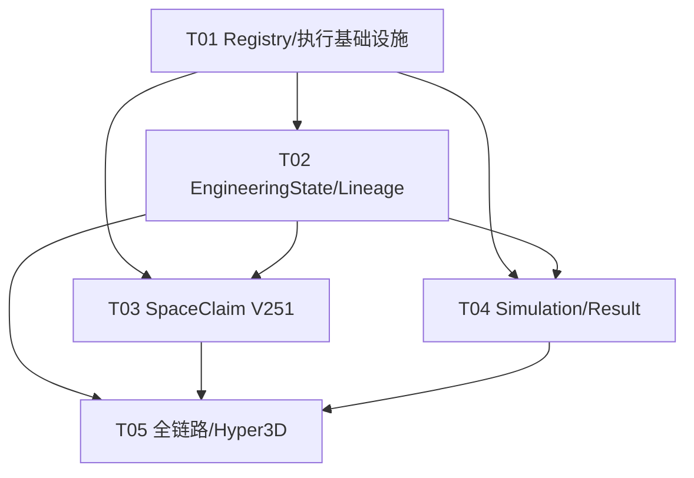

# ThermalForge 完整 Agent 系统架构与实施任务

> 基线：增量扩展当前 `core/agents`、`AgentPipelineRuntime`、`EngineeringStateService`、`SimulationOrchestrationService` 与 SpaceClaim runner；禁止另建平行状态或注册体系。

## 1. 总体实现方案与框架选型

### 1.1 架构原则

采用 **FastAPI 路由 / 应用服务 / Pydantic 契约 / 隔离 Adapter** 的分层架构，并以事件审计补充现有内存状态机：

1. `AgentPipeline` 只负责工作流状态、Agent 执行关联和展示支路，不再承载下游工程真值；其 `EngineeringSpecification` 是摄取/抽取阶段 DTO。
2. `EngineeringState(project_id, revision)` 是几何、材料、载荷、工况、接口及仿真的唯一事实源。下游输入必须按明确 revision 从 `EngineeringStateService.get()` 获取，禁止从 pipeline specification、LLM 文本或 Hyper3D 结果直接编译。
3. 现有 `core.agents.AgentRegistry` 扩展为 Definition/Prompt/Skill/Tool/Execution 五类注册能力；注册和启动双重强制 `gpt-5.6-sol`。
4. LLM Agent 只产出严格 Pydantic DTO，不持有 `network/filesystem_write/shell/secrets_read`；SpaceClaim、Hyper3D、Fluent、Mechanical 外部副作用仅在受控 Adapter 中发生。
5. Artifact Registry 是不可变登记簿；每个产物带 hash、producer/version、input revision、provider/fidelity、URI、task UUID 与父产物引用，形成可反向遍历 lineage。
6. SpaceClaim 协议锁定 `SpaceClaim.Api.V251`。现有 `core/engine/spaceclaim.py` 的 V252 冷板能力保留用于旧流程；新增 V251 工程关节脚本编译器并复用/收紧 `SpaceClaimRunner`，不得静默按本机版本漂移。

### 1.2 核心难点与收敛方案

- **双状态收敛**：`AgentPipeline.specification` 保持向后兼容，但在人工审核后由显式归一化服务写入新 EngineeringState revision；后续只引用 `project_id + engineering_revision`。
- **全面确认判定**：集中实现 `EngineeringStateGate.validate_for_geometry/simulation()`，递归检查关键 `TracedValue`/`EngineeringValue` 的 `confirmed + evidence`、unresolved、分主题 Approval，避免编译器各自散落规则。
- **协议引用完整性**：SpaceClaim handoff 与 Simulation handoff 分离。前者负责 V251 几何参数、接口、Named Selection 计划及输出；后者引用已登记几何并补充 mesh/solver/acceptance。编译阶段检查 ID 唯一性及 loads/contacts/cases 的闭包引用。
- **失败结果留痕**：当前 `SimulationResultIngestor` 以异常拒绝未收敛/超阈值，导致结果无法留存。调整为先验证身份/schema并不可变登记，再生成 `ResultAcceptance(status, violations)`；只有通过才完成，失败进入 review/revision 分支。
- **旧 runner 版本漂移**：新增 `required_api_version="V251"` 参数和 preflight 断言；Agent 系统适配器拒绝 V252/V261。旧冷板调用默认行为不改。

### 1.3 采用框架

- **Python 3.11+**：沿用项目运行时。
- **FastAPI**：现有 HTTP/DI/错误映射层。
- **Pydantic v2 / pydantic-settings**：严格 schema、判别联合、跨字段校验、JSON Schema。
- **httpx / 现有 provider client**：仅供 Hyper3D/OpenAI Adapter 使用。
- **pytest + pytest-asyncio + FastAPI TestClient/httpx ASGITransport**：契约、服务、路由及闭环测试。
- **threading.RLock**：保持当前进程内仓储兼容；接口化 repository 为后续数据库迁移预留边界。

## 2. Registry 与执行治理

### 2.1 注册对象

- `PromptDefinition(id, version, template, sha256)`：注册时重算 UTF-8 SHA-256；建议键升级为 `(id, version)`，旧 `get(id)` 映射唯一/最新版本。
- `SkillDefinition(id, version, description)`：声明可复用推理能力，不等同于执行权限。
- `ToolDefinition(id, description, required_permissions, adapter_only)`：工具白名单；外部副作用工具必须 `adapter_only=True`，不能挂到 LLM Agent。
- `AgentDefinition`：声明 model、prompt、输入/输出 JSON Schema、skills、tools、permissions、quality gates、retry policy。
- `ExecutionRecord`：持久记录 agent/version、model、prompt id/version/hash、skills/tools、status/timestamps、project/pipeline/input revision、input/output artifact ids、error。

### 2.2 `gpt-5.6-sol` 强制策略

定义常量 `REQUIRED_LLM_MODEL = "gpt-5.6-sol"`：

1. `Settings.openai_text_model` 默认值保持该模型，并增加 validator：生产/正式 Agent 模式下其他值启动失败。
2. `AgentRegistry.register()` 不再仅与 Settings 相等，而是明确要求 `definition.model == REQUIRED_LLM_MODEL`，同时要求 Settings 也等于该值。
3. `AgentExecutionService.execute()` 调 provider 前再次断言 definition、request/effective model 均为常量，调用方不得覆盖 model。
4. 测试替身应替换 provider client，不替换模型名；记录仍为 `gpt-5.6-sol`。

### 2.3 Agent 与 Adapter 职责边界

| 单元 | 输入 | 输出 | 权限/禁止事项 |
|---|---|---|---|
| Intake Agent/服务 | SourceAsset | project/pipeline、source artifact | 仅登记与调用方提供内容读取 |
| Specification Agent | source content | 严格 extraction DTO | LLM，只读；不确认、不猜测 |
| Component Analysis Agent | EngineeringState 草案 | semantic candidates/review items | LLM，只读；不写事实 |
| Human Review Gate | revision + identity + evidence | 新 revision + Approval | 非 LLM；optimistic lock；不可代签 |
| Geometry Compiler Agent | confirmed EngineeringState | `SpaceClaimHandoffContract` 草案 | LLM/确定性后处理；不得 shell/network |
| SpaceClaim V251 Adapter | 已批准 handoff | script/STEP/SCDOC/render/log artifacts | 限定 workspace 与 V251 executable；禁止开放命令 |
| Hyper3D Compiler Agent | engineering proxy renders | Rodin contract | 只读；不成为工程输入 |
| Hyper3D Adapter | Rodin contract | Hyper3D artifacts | 限域网络；强制 `concept_mesh` |
| Simulation Planner Agent | approved state + geometry | SimulationHandoffContract | 只读；不执行 solver |
| Fluent Adapter | approved CFD handoff | raw result + artifacts | 仅 Fluent/工作目录 |
| Mechanical Adapter | approved FEA handoff | raw result + artifacts | 仅 Mechanical/工作目录 |
| Result Interpreter Agent | accepted/rejected result envelope | ValidationReport/建议 | 只读；不得覆盖结果或事实 |
| ArtifactRegistryService | artifact + parents | immutable registry entry | 服务端受控写；hash/revision 校验 |

## 3. EngineeringState 唯一事实源与审批

- 每次 `put/confirm/revise` 追加 revision，不覆盖历史；`expected_revision` 不匹配返回 409。
- 将 `Component.dimensions`、`Material.properties` 统一为带类型值、单位、状态、证据的 traced value（迁移期兼容现有 `EngineeringValue`）。
- 主题审批至少包括 `specification`、`component_semantics`、`materials`、`loads_cases`、`geometry_solver`；审批绑定被审 revision。审批动作产生新 revision 时，gate 应验证 approval 的 `approved_revision` 指向事实 revision，避免当前实现 revision 语义歧义。
- 任一 unresolved、证据为空、关键状态非 confirmed、材料必需属性缺失、引用悬空，均禁止几何/仿真编译。
- pipeline 仅保存 `project_id` 和当前/输入 revision 引用；不得复制修改 EngineeringState。

## 4. Artifact lineage

扩展 `Artifact`：`project_id`（由注册上下文校验）、`parent_artifact_ids`、`execution_id`、`handoff_id`、`created_at`、可选 `media_type/size_bytes`。`content_hash` 统一为小写 SHA-256。

登记规则：

1. ID 与 `(provider, uri, content_hash)` 不可变，重复 ID 仅允许完全幂等请求。
2. parent 必须存在于同项目；子产物 `input_revision` 必须与 handoff/state 相符。
3. source → extraction/execution → SpaceClaim handoff/script → geometry/render → simulation handoff → mesh/log/field/report/image/result，可反向遍历。
4. Hyper3D provider 产物强制 fidelity=`concept_mesh`；concept mesh 不得作为 SpaceClaim/Simulation geometry parent，也不得晋级 manufacturing CAD。
5. manufacturing CAD 晋级必须独立人工 Approval；不能通过修改 artifact 实现。

## 5. SpaceClaim V251、仿真与 Hyper3D

### 5.1 SpaceClaimHandoffContract

新增独立严格契约：`schema=thermalforge.spaceclaim_handoff`、`version=1.0.0`、`provider=spaceclaim`、`api_version=V251`、project/revision/approval、units/coordinate system、joints（内外半径、轴向长度、壁厚、轴线、segment、fins）、components/interfaces/material refs、thermal regions、named selections、contacts、output plan。脚本仅由确定性 renderer 生成，不直接采用 LLM 脚本文本。

`SpaceClaimV251Adapter`：校验 handoff → 创建隔离 workspace → renderer 输出固定 API import → runner 以 `required_api_version=V251` preflight/run → 计算 script/geometry/log/render hash → 批量登记 artifact。失败也登记 script/log/manifest 并产生 execution failed。

### 5.2 SimulationHandoff/Result

保留现有 `SimulationHandoffContract`，增加显式 `handoff_id`、`geometry_artifact_id`/上游 SpaceClaim handoff 引用及审批信息；compiler 必须读取确切 state revision 和 Artifact Registry。

结果流程拆成：

- `validate_identity()`：schema、handoff id、project、revision、model、solver/case 集合；不一致拒绝登记为该 handoff。
- `register_raw_result()`：登记原始结果与所有 solver artifacts。
- `evaluate_acceptance()`：收敛、最高温、CFD 压降、FEA 应力/安全系数，返回结构化 violations。
- 未通过仍保留 result，handoff 状态为 `review_required`；禁止自动修改 EngineeringState 或重提求解。

### 5.3 Hyper3D 展示支路

仅从已登记 engineering proxy 的 reference render 分支。Hyper3D contract 和 task UUID 纳入 execution/lineage；返回产物无论格式均强制 concept_mesh。Frontend manifest 同时显示 engineering proxy 与 concept mesh，并保留当前免责声明。该支路不阻塞 Fluent/Mechanical 主流程，也永不作为仿真几何。

## 6. API 设计

沿用 `/api/v1`：

| Method / Path | 说明 |
|---|---|
| `GET /agent-definitions` | 查看脱敏 Definition/Prompt hash/Skill/Tool policy |
| `GET /agent-executions/{id}` | 查询执行审计 |
| `GET /agent-executions?project_id=&revision=` | 按工程 revision 查询 |
| `PUT /engineering-projects/{id}/state` | optimistic 新增 revision（现有） |
| `GET /engineering-projects/{id}/state?revision=` | 获取确切 revision（现有） |
| `POST /engineering-projects/{id}/confirm` | 人工主题审批（扩展 approval subject） |
| `GET /engineering-projects/{id}/review-summary` | diff、unresolved、低置信度、假设与影响 |
| `POST /engineering-projects/{id}/artifacts` | 不可变 artifact 登记（现有扩展） |
| `GET /engineering-projects/{id}/artifacts/{artifact_id}/lineage` | 反查 lineage |
| `POST /spaceclaim-handoffs/projects/{id}` | 从 confirmed state 编译 V251 handoff |
| `POST /spaceclaim-handoffs/{id}/execute` | 调隔离 SpaceClaim Adapter |
| `GET /spaceclaim-handoffs/{id}` | 查询 handoff/执行状态 |
| `POST /simulation-handoffs/projects/{id}` | 编译现有 SimulationHandoff |
| `POST /simulation-handoffs/{id}/execute` | 按 model 路由 Fluent/Mechanical Adapter |
| `POST /simulation-handoffs/{id}/result` | 身份校验、原始回灌、验收 |
| `GET /simulation-handoffs/{id}/validation-summary` | passed/review_required 与 violations |

错误：422 schema/路径不一致；404 资源不存在；409 revision/状态/人工门/引用冲突；503 Adapter/provider 不可用。响应暂沿用 FastAPI 现有模型，避免破坏客户端；若未来统一 envelope 应另行版本化。

## 7. 文件列表（相对路径）

### 现有修改
- `core/config.py`
- `core/agents/contracts.py`
- `core/agents/registry.py`
- `core/agents/definitions.py`
- `core/models/agent_pipeline.py`
- `core/services/agent_pipeline.py`
- `core/models/engineering_state.py`
- `core/services/engineering_state.py`
- `core/models/simulation_contract.py`
- `core/services/simulation_contract.py`
- `core/services/simulation_orchestration.py`
- `core/engine/spaceclaim.py`
- `core/engine/spaceclaim_runner.py`
- `core/api/routes/agent_pipeline.py`
- `core/api/routes/engineering_state.py`
- `core/api/routes/simulation_orchestration.py`
- `core/api/routes/__init__.py`
- `tests/test_agent_protocol.py`
- `tests/test_agent_pipeline.py`
- `tests/test_engineering_state.py`
- `tests/test_simulation_contract.py`
- `tests/test_simulation_orchestration_api.py`
- `tests/test_spaceclaim_cold_plate_pipeline.py`

### 新增
- `core/agents/execution.py`：统一执行、model/tool policy 与审计记录
- `core/models/spaceclaim_contract.py`：V251 handoff/execute DTO
- `core/services/spaceclaim_orchestration.py`：编译/执行/登记
- `core/adapters/base.py`：受控 Adapter protocol/result
- `core/adapters/spaceclaim_v251.py`
- `core/adapters/hyper3d.py`
- `core/adapters/fluent.py`
- `core/adapters/mechanical.py`
- `core/api/routes/agent_registry.py`
- `core/api/routes/spaceclaim_orchestration.py`
- `tests/test_agent_execution.py`
- `tests/test_spaceclaim_contract.py`
- `tests/test_artifact_lineage.py`
- `tests/test_full_agent_system.py`

## 8. Pydantic 数据结构与接口

关键新增/调整（均 `extra="forbid"`；边界契约建议 `strict=True`）：

```python
REQUIRED_LLM_MODEL: Final[str] = "gpt-5.6-sol"

class ExecutionContext(BaseModel):
    project_id: str
    pipeline_id: UUID | None
    engineering_revision: int | None
    input_artifact_ids: tuple[str, ...] = ()

class ExecutionRecord(BaseModel):
    id: UUID
    agent_id: str
    agent_version: str
    model: Literal["gpt-5.6-sol"]
    prompt_id: str
    prompt_version: str
    prompt_hash: str
    skills: tuple[str, ...]
    tools: tuple[str, ...]
    status: Literal["started", "succeeded", "failed"]
    context: ExecutionContext
    output_artifact_ids: tuple[str, ...] = ()
    started_at: datetime
    completed_at: datetime | None
    error: str | None

class Artifact(BaseModel):
    id: str; role: str; uri: str; provider: str
    fidelity: ArtifactFidelity; content_hash: str
    producer: str; version: str; input_revision: int
    parent_artifact_ids: tuple[str, ...] = ()
    execution_id: UUID | None = None
    handoff_id: str | None = None
    task_uuid: str | None = None

class SpaceClaimHandoffContract(BaseModel):
    schema: Literal["thermalforge.spaceclaim_handoff"]
    version: Literal["1.0.0"]
    id: str; project_id: str; engineering_revision: int
    provider: Literal["spaceclaim"] = "spaceclaim"
    api_version: Literal["V251"] = "V251"
    approval_status: Literal["approved"]
    units: UnitSystem; coordinate_system: CoordinateSystem
    joints: list[JointParameters]
    components: list[SpaceClaimComponent]
    interfaces: list[SpaceClaimInterface]
    materials: list[MaterialProperties]
    named_selections: list[NamedSelection]
    contacts: list[Contact]
    output_plan: SpaceClaimOutputPlan

class ResultAcceptance(BaseModel):
    status: Literal["passed", "review_required"]
    violations: list[AcceptanceViolation]
    evaluated_at: datetime
```

服务接口：

```python
class AgentExecutionService:
    async def execute(self, agent_id: str, payload: BaseModel, context: ExecutionContext) -> BaseModel: ...

class EngineeringStateGate:
    def validate_for_geometry(self, state: EngineeringState) -> None: ...
    def validate_for_simulation(self, state: EngineeringState) -> None: ...

class ArtifactRegistryService:
    def register(self, project_id: str, artifact: Artifact, expected_revision: int) -> Artifact: ...
    def lineage(self, project_id: str, artifact_id: str) -> ArtifactLineage: ...

class SpaceClaimV251Adapter:
    def execute(self, handoff: SpaceClaimHandoffContract) -> AdapterExecutionResult: ...

class SolverAdapter(Protocol):
    def execute(self, handoff: SimulationHandoffContract) -> AdapterExecutionResult: ...
```

## 9. 类图

```mermaid
classDiagram
  class AgentDefinition {+str id +str version +str model +str prompt_id +dict input_schema +dict output_schema +tuple skills +tuple tools +tuple permissions}
  class PromptDefinition {+str id +str version +str sha256 +str template}
  class AgentRegistry {+register(definition) +get(agent_id) AgentDefinition +policy_for(agent_id) ToolPolicy}
  class AgentExecutionService {+execute(agent_id,payload,context) BaseModel}
  class ExecutionRecord {+UUID id +str agent_id +str model +str prompt_hash +str status +ExecutionContext context}
  class EngineeringState {+str project_id +int revision +list joints +list components +list materials +list approvals +list unresolved}
  class EngineeringStateService {+put(state,expected_revision) EngineeringState +get(project_id,revision) EngineeringState +confirm(...) EngineeringState}
  class EngineeringStateGate {+validate_for_geometry(state) +validate_for_simulation(state)}
  class Artifact {+str id +str role +str uri +ArtifactFidelity fidelity +str content_hash +int input_revision +tuple parent_artifact_ids}
  class ArtifactRegistryService {+register(...) Artifact +lineage(...) ArtifactLineage}
  class SpaceClaimHandoffContract {+str id +Literal provider +Literal api_version +int engineering_revision +list joints +list named_selections}
  class SimulationHandoffContract {+str project_id +int engineering_revision +str model +GeometryGenerator geometry_generator}
  class SimulationResultContract {+str handoff_id +str model +list cases +list artifacts}
  class SpaceClaimOrchestrationService {+compile(project_id,revision) SpaceClaimHandoffContract +execute(handoff_id) list~Artifact~}
  class SimulationOrchestrationService {+compile(project_id,request) SimulationHandoffContract +register_result(id,result) ResultAcceptance}
  class SpaceClaimV251Adapter {+execute(handoff) AdapterExecutionResult}
  class FluentAdapter {+execute(handoff) AdapterExecutionResult}
  class MechanicalAdapter {+execute(handoff) AdapterExecutionResult}

  AgentRegistry o-- AgentDefinition
  AgentDefinition --> PromptDefinition
  AgentExecutionService --> AgentRegistry
  AgentExecutionService o-- ExecutionRecord
  EngineeringStateService o-- EngineeringState
  EngineeringStateGate --> EngineeringState
  ArtifactRegistryService o-- Artifact
  SpaceClaimOrchestrationService --> EngineeringStateService
  SpaceClaimOrchestrationService --> EngineeringStateGate
  SpaceClaimOrchestrationService --> SpaceClaimV251Adapter
  SpaceClaimOrchestrationService --> ArtifactRegistryService
  SpaceClaimHandoffContract --> EngineeringState : compiled from exact revision
  SimulationOrchestrationService --> EngineeringStateService
  SimulationOrchestrationService --> ArtifactRegistryService
  SimulationOrchestrationService --> FluentAdapter
  SimulationOrchestrationService --> MechanicalAdapter
  SimulationHandoffContract --> Artifact : uses engineering geometry
  SimulationResultContract --> SimulationHandoffContract : binds handoff
```



## 10. 关键时序

```mermaid
sequenceDiagram
  actor U as Engineer
  participant API as FastAPI
  participant ES as EngineeringStateService
  participant Gate as EngineeringStateGate
  participant Exec as AgentExecutionService
  participant SC as SpaceClaimOrchestrationService
  participant SCA as SpaceClaimV251Adapter
  participant AR as ArtifactRegistryService
  participant SIM as SimulationOrchestrationService
  participant Solver as Fluent/MechanicalAdapter

  U->>API: PUT state(expected_revision, draft)
  API->>ES: put(draft, expected_revision)
  ES-->>API: immutable revision N
  U->>API: POST confirm(revision N, identity, evidence)
  API->>ES: confirm(...)
  ES-->>API: revision N+1 + Approval

  U->>API: POST spaceclaim-handoffs(project, N+1)
  API->>SC: compile(project, N+1)
  SC->>ES: get(project, N+1)
  SC->>Gate: validate_for_geometry(state)
  Gate-->>SC: approved/confirmed
  SC-->>API: SpaceClaimHandoff(V251)
  U->>API: POST handoff/execute
  API->>SCA: execute(handoff)
  SCA->>SCA: render deterministic V251 script + isolated run
  SCA-->>SC: script/geometry/log/render outputs
  loop each output
    SC->>AR: register(hash, revision, parents)
  end

  opt Hyper3D display branch
    API->>Exec: execute(hyper3d_compiler_agent, renders, context)
    Exec-->>API: Rodin contract + audit
    Note over API,AR: Adapter result is always concept_mesh and never solver geometry
  end

  U->>API: POST simulation-handoffs(project, geometry artifact)
  API->>SIM: compile(project, request)
  SIM->>ES: get(exact revision)
  SIM->>AR: get engineering geometry
  SIM->>Gate: validate_for_simulation(state)
  SIM-->>API: SimulationHandoff
  U->>API: POST simulation handoff/execute
  API->>Solver: execute(handoff)
  Solver-->>SIM: raw result + artifacts
  SIM->>AR: register raw artifacts/result lineage
  SIM->>SIM: validate identity/cases + evaluate acceptance
  alt passed
    SIM-->>API: passed
  else failed/unconverged
    SIM-->>API: review_required + violations
    Note over U,ES: Human creates new EngineeringState revision; history remains
  end
```

## 11. 迁移与兼容策略

1. **先加后收紧**：Pydantic 新字段先提供安全默认（parents 空、execution null）；旧 API response 字段不删除。
2. `PipelineArtifact` 与 `Artifact` 暂保留，新增单向映射 `PipelineArtifact -> Artifact`；所有新写入统一走 EngineeringState Artifact Registry，pipeline 只保存 artifact id/展示投影。后续 major version 再移除重复模型。
3. 现有内存服务保持默认实现；通过构造注入 repository/registry，未来持久化不改变 API/编译器。
4. `SimulationHandoffContract` 1.0.0 的消费者保持可读；新增关联字段若破坏 schema 则发布 1.1.0 判别联合，禁止悄改 1.0.0。
5. `SimulationResultIngestor.ingest()` 保留旧“失败抛异常”方法供旧测试，新增 `ingest_and_evaluate()` 给新 API；迁移完成后再统一语义。
6. `core/engine/spaceclaim.py` 默认 V252 冷板路径不改；Agent V251 使用新增 renderer/adapter，并向 runner 显式传 required version。
7. rollout 顺序：注册/审计与模型门 → Engineering gate/lineage → V251 handoff/adapter → solver adapter/result acceptance → pipeline/API 集成。

## 12. 测试策略

- **模型/Registry 单测**：prompt hash、重复版本、未知 skill/tool、权限不足、任何非 gpt-5.6-sol 注册/执行均失败。
- **事实源属性测试**：optimistic revision、历史不可变、审批绑定、递归关键值确认、evidence/unresolved/悬空引用门禁。
- **Artifact 测试**：hash 格式、幂等/冲突、parent 闭包、跨项目拒绝、lineage 反查、concept mesh 污染路径拒绝。
- **SpaceClaim 契约测试**：固定 V251、引用唯一/完整、生成脚本包含 `from SpaceClaim.Api.V251 import *`；runner 使用 fake executable/process，不要求 CI 许可证；保留旧 V252 冷板回归。
- **仿真测试**：CFD/FEA/coupled 必填指标，project/revision/handoff/model/case/solver 不匹配，未收敛与阈值失败仍登记且 review_required。
- **API/闭环测试**：source→extract→state→human gates→V251 artifacts→simulation→result→lineage；409/422/404/503 映射。
- **安全测试**：LLM policy 默认拒绝四类高危权限，LLM 无法调用 adapter-only tool，路径必须位于隔离 workspace。

## 13. 有序任务列表（最多 5 项）

### T01 项目基础设施与正式 Registry 基线（P0）
- **文件**：`core/config.py`、`core/agents/contracts.py`、`core/agents/registry.py`、`core/agents/definitions.py`、`core/agents/execution.py`、`core/api/routes/agent_registry.py`、`core/api/routes/__init__.py`、`tests/test_agent_protocol.py`、`tests/test_agent_execution.py`
- **内容**：gpt-5.6-sol 三重门、版本化 Definition/Prompt/Skill/Tool、adapter-only policy、Execution Registry/API。
- **依赖**：无。

### T02 EngineeringState 门禁与 Artifact lineage（P0）
- **文件**：`core/models/engineering_state.py`、`core/services/engineering_state.py`、`core/models/agent_pipeline.py`、`core/services/agent_pipeline.py`、`core/api/routes/engineering_state.py`、`tests/test_engineering_state.py`、`tests/test_artifact_lineage.py`
- **内容**：事实源归一化、主题审批、递归确认 gate、不可变 lineage、pipeline 只引用 revision/artifact。
- **依赖**：T01。

### T03 SpaceClaim.Api.V251 契约与隔离 Adapter（P0）
- **文件**：`core/models/spaceclaim_contract.py`、`core/services/spaceclaim_orchestration.py`、`core/adapters/base.py`、`core/adapters/spaceclaim_v251.py`、`core/engine/spaceclaim.py`、`core/engine/spaceclaim_runner.py`、`core/api/routes/spaceclaim_orchestration.py`、`tests/test_spaceclaim_contract.py`、`tests/test_spaceclaim_cold_plate_pipeline.py`
- **内容**：确定性 V251 renderer、版本 preflight、workspace 限制、产物批量登记；旧 V252 冷板兼容。
- **依赖**：T01、T02。

### T04 仿真 Adapter、结果回灌与验收分支（P0）
- **文件**：`core/models/simulation_contract.py`、`core/services/simulation_contract.py`、`core/services/simulation_orchestration.py`、`core/adapters/fluent.py`、`core/adapters/mechanical.py`、`core/api/routes/simulation_orchestration.py`、`tests/test_simulation_contract.py`、`tests/test_simulation_orchestration_api.py`
- **内容**：按 model 路由、原始结果不可变登记、身份/指标校验、passed/review_required 分离。
- **依赖**：T01、T02；与 T03 可并行开发，集成时消费其 geometry artifact。

### T05 全链路集成、Hyper3D 支路与回归（P1）
- **文件**：`core/adapters/hyper3d.py`、`core/services/agent_pipeline.py`、`core/api/routes/agent_pipeline.py`、`core/services/spaceclaim_orchestration.py`、`core/services/simulation_orchestration.py`、`tests/test_agent_pipeline.py`、`tests/test_full_agent_system.py`、`tests/test_parameter_geometry_simulation_pipeline.py`
- **内容**：审计关联、Hyper3D 强制 concept_mesh、主/展示支路集成、失败 revision 分支、全量回归。
- **依赖**：T02、T03、T04。



## 14. 共享约定

- 所有时间为带时区 ISO 8601 UTC；所有 hash 为 SHA-256 小写十六进制。
- 所有工程长度/角度/功率以契约显式单位表达；不得依赖隐式 CAD 单位。
- LLM 有效模型恒为 `gpt-5.6-sol`；mock provider 不改变模型标识。
- Pydantic 边界 DTO `extra=forbid`；不确定事实写 unresolved，禁止填造默认工程值。
- 状态、审批、execution、artifact、handoff、result 均追加写；禁止覆盖历史。
- 外部 Adapter 使用 allowlisted executable/endpoint 与隔离 workspace；LLM 永不获得 shell/secrets。
- `concept_mesh` 只展示；仿真几何仅 `engineering_proxy`/`manufacturing_cad`。
- Named Selection 在 handoff 内唯一，所有 load/contact/boundary 引用必须闭合。
- 人工审批必须包含身份、主题、被审 revision、证据和 UTC 时间。

## 15. 待明确事项与本设计假设

1. SpaceClaim V251 的实际调用形态与许可证：当前假设复用 Windows 本机 runner，正式部署前确认 Workbench/ACT/远程队列。
2. Fluent/Mechanical 版本、命令行/队列接口、许可证、并发、超时与取消语义未定；Adapter 先以 protocol + fake 实现边界。
3. 人工身份认证、角色和电子签名未定义；当前只校验非空 identity/evidence，不等同合规签名。
4. manufacturing CAD 晋级主体未定；本设计默认仅 CAD 工程师人工签发。
5. 材料/接触/CFD/FEA 参数是否需扩展公差、辐射、湍流、重力、时序、疲劳仍待领域确认；通过版本化 contract 扩展。
6. Artifact 持久化、对象存储 URI、ACL、签名 URL 与保留期未定；当前保持进程内 Registry 接口但不可变语义不变。
7. API 是否统一 `{code,data,message}` 未有现存约定；本设计优先兼容当前裸 response，未来应新 API 版本迁移。
8. `SimulationResult` 未达阈值时“拒绝完成”解释为保存原始结果并标记 review_required，而非丢弃结果。
