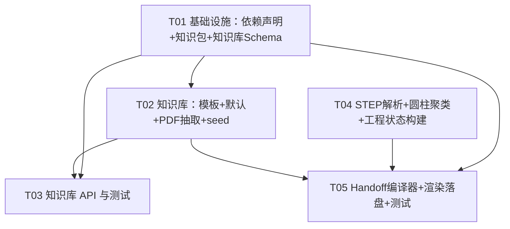

# ThermalForge 增量特性 — 系统架构设计 + 任务分解

> 作者：高见远（软件架构师 / software-architect）
> 范围：特性一（真实 STEP → EngineeringState → 首份 SpaceClaim Handoff）+ 特性二（文档模板 + PDF 预提取知识库）
> 依据：`docs/agent-system/examples/engineering-state.v1.json`、`spaceclaim-handoff.v1.json`，以及已裁决决策 OQ1–OQ7。
> 说明：本文档**只做设计**，不含实现代码；仅给出类名、方法签名、关键算法与文件落地。

---

## Part A：系统设计

### 1. 实现方案（Implementation Approach）

#### 1.1 技术难点与框架选型

| 难点 | 方案 | 选型理由 |
|------|------|----------|
| F1-P0-1 零依赖 STEP 解析 | 标准库手写词法解析器（ISO-10303-21 为纯文本 DATA 段），重建实体图后抽取圆柱面/体 | **不引入 numpy / OCC / steputils**（项目未装，PRD 要求零依赖）；仅用 `re` + `pathlib` 即可满足输出 `bbox_mm / part_count / cylinders[{radius_mm, axis}]` |
| F1-P0-2 工程状态构建 | Builder 模式：STEP 解析结果 → `EngineeringState(revision=1)`，所有 `TracedValue` 带 `evidence` | 复用既有 `core.models.engineering_state`（已含 `Joint` 校验 inner<outer、shell>0、axis 非零） |
| F1-P0-3 新 Handoff 编译器 | **新建** `SpaceClaimHandoffCompiler`，直接由 `EngineeringState` → `SpaceClaimHandoffContract`（**不走** `SimulationContractCompiler` 的 approved 门，见 OQ4） | 几何交接不需 simulation 审批；`approval_status` 由模型常量强制 `approved` |
| F2 文档模板 | Pydantic 模板类，`motor_type` 默认 `"BLDC"` | 复用项目既有 pydantic 体系 |
| F2 知识库 | 标准库 `sqlite3` 单库 `data/knowledge.db`，索引列 `motor_type / material / keyword` | 全局共享、零额外依赖；FTS5 留作 P2（OQ2） |
| F2 PDF 预提取 | `pypdf`（**可选**）做文本抽取；缺失则 stdlib 兜底（见 §6） | 满足"优先 pypdf、缺失标注"的约束 |
| API 暴露 | FastAPI（项目已集成）新增 `core/api/routes/knowledge.py` 并挂载到 `core/api/app.py` | 与既有 `engineering_state.py` 等路由同构 |

#### 1.2 架构模式

- **分层 + 管道（Pipeline）**：`core/engine`（解析）→ `core/services`（Builder/Compiler）→ `core/api/routes`（暴露）。
- **编译器/构建器分离**：`StepReader`（纯解析，无状态）→ `StepToEngineeringStateBuilder`（→ EngineeringState）→ `SpaceClaimHandoffCompiler`（→ Handoff）。三者松耦合、可单测。
- **约定优于配置**：evidence 命名、默认 BLDC JSON 形状、单位、status 全部走共享约定（见 §8），减少跨文件歧义。

---

### 2. 文件列表（区分新建 / 修改）

> 路径均相对项目根 `C:\Users\llwxy\Desktop\thermalforge`。`core/knowledge/` 当前不存在，需新建包目录。

**特性一（STEP → State → Handoff）**
| 状态 | 路径 | 职责 |
|------|------|------|
| 新建 | `core/engine/step_reader.py` | 零依赖 STEP 词法解析 + 几何抽取（输出 `StepParseResult`） |
| 新建 | `core/services/engineering_state_from_step.py` | `StepToEngineeringStateBuilder`：解析结果 → `EngineeringState` |
| 新建 | `core/services/spaceclaim_handoff.py` | `SpaceClaimHandoffCompiler`：EngineeringState → `SpaceClaimHandoffContract`（新编译器，OQ4） |
| 新建 | `scripts/build_engineering_state_from_step.py` | 驱动 F1-P0-1/2，落盘 `engineering-state.json` |
| 新建 | `scripts/build_spaceclaim_handoff.py` | 驱动 F1-P0-3/4，落盘 `spaceclaim-handoff.json` + 渲染 `.py` |
| 新建 | `outputs/iki1602/.gitkeep` + 产物约定 | 运行时产出 `engineering-state.json / spaceclaim-handoff.json / spaceclaim-handoff.py` |

**特性二（模板 + PDF 知识库）**
| 状态 | 路径 | 职责 |
|------|------|------|
| 新建 | `core/knowledge/__init__.py` | 包入口，re-export 公共 API |
| 新建 | `core/knowledge/templates.py` | `MotorDatasheetTemplate` / `RobotArmSpecTemplate` / `MaterialSpecTemplate` |
| 新建 | `core/knowledge/defaults.py` | `BldcDefaults`：默认 BLDC 目录、默认材质表（8 字段）、默认热损比例（OQ1/OQ3/OQ5） |
| 新建 | `core/knowledge/library.py` | `KnowledgeLibrary`（sqlite3 封装）：`MotorEntry/MaterialEntry/DocEntry` + 检索 API |
| 新建 | `core/knowledge/extractor.py` | `PdfExtractor`：抽取 → 套模板 → 幂等入库（OQ7 低置信标 needs_review） |
| 新建 | `core/api/routes/knowledge.py` | 检索路由：`/api/v1/knowledge/{motor-type,material,keyword}` |
| 修改 | `core/api/app.py` | `include_router(knowledge_router)`（约 line 66 后插入） |
| 新建 | `scripts/seed_knowledge_base.py` | 固化通用默认条目（BLDC / 默认材质），可重复执行幂等 |

**测试（新建）**
| 状态 | 路径 | 覆盖 |
|------|------|------|
| 新建 | `tests/test_step_reader.py` | 解析器 + 圆柱抽取 + 边界（无圆柱） |
| 新建 | `tests/test_spaceclaim_handoff.py` | 新编译器输出符合 `spaceclaim-handoff.v1.json` 形状 |
| 新建 | `tests/test_knowledge_templates.py` | 模板默认值与 BLDC 识别（OQ2） |
| 新建 | `tests/test_knowledge_library.py` | 建表、upsert 幂等、三类检索 |
| 新建 | `tests/test_knowledge_extractor.py` | PDF → 模板 → 入库（含 needs_review 分支） |

**设计文档（新建）**
| 状态 | 路径 |
|------|------|
| 新建 | `docs/system_design.md`（本文件） |
| 新建 | `docs/class-diagram.mermaid` |
| 新建 | `docs/sequence-diagram.mermaid` |

**依赖声明（修改）**
| 状态 | 路径 | 说明 |
|------|------|------|
| 修改 | `requirements.txt` | 确认仅 pydantic + stdlib；可选 `pypdf>=4.0` 标注（见 §6） |

---

### 3. 数据结构与接口（Data Structures and Interfaces）

完整类图见 `docs/class-diagram.mermaid`。下方给出关键契约要点与字段映射。

#### 3.1 特性一核心类型

```python
# core/engine/step_reader.py
class CylinderFeature:            # 单个圆柱面/体
    entity_id: str                # STEP 实体号，用作 evidence.locator
    radius_mm: float
    axis: tuple[float, float, float]
    center_mm: tuple[float, float, float]
    length_mm: float | None       # 圆柱面无法得长度时为 None
    part_id: str                  # 所属顶层 part

class StepParseResult:
    source_id: str                # f"step:{Path(name).name}"
    bbox_mm: tuple[float, float, float]
    part_count: int
    cylinders: list[CylinderFeature]

class StepReader:
    def parse(self, path: Path) -> StepParseResult: ...
```

```python
# core/services/engineering_state_from_step.py
class StepToEngineeringStateBuilder:
    def build(self, project_id: str, result: StepParseResult,
              source_path: Path) -> EngineeringState: ...
    # 内部：_cluster_joints / _default_materials / _default_thermal_loads / _default_operating_cases
```

```python
# core/services/spaceclaim_handoff.py  —— 新编译器（OQ4：不走 SimulationContractCompiler）
class SpaceClaimHandoffCompiler:
    def compile(self, state: EngineeringState) -> SpaceClaimHandoffContract: ...
    # 每个 Joint → JointParameters：
    #   segment_angle_deg = 360（OQ3，无法推导时）
    #   fins = FinParameters(count=12, height_mm=8, thickness_mm=1.0, pitch_deg=30)（OQ3）
    # 每个 Material → MaterialProperties(8 字段)，缺字段查 BldcDefaults.default_material_properties（OQ5）
    # 派生 named_selections（每关节 shell/load 各一）+ contacts（相邻壳 bonded，可空）
    # output_plan.workspace_uri = f"file:///isolated/{project_id}"
    # approval_status 由模型常量强制 "approved"
```

#### 3.2 特性二核心类型

```python
# core/knowledge/templates.py
class MotorDatasheetTemplate(StrictModel):
    motor_type: str = "BLDC"                       # OQ2 默认 BLDC
    rated_power_w: float | None = None
    rated_voltage_v: float | None = None
    rated_speed_rpm: float | None = None
    winding_resistance_ohm: float | None = None
    efficiency: float | None = None

class RobotArmSpecTemplate(StrictModel):
    motor_type: str = "BLDC"
    dof: int | None = None
    reach_mm: float | None = None
    payload_kg: float | None = None

class MaterialSpecTemplate(StrictModel):
    name: str
    density_kg_m3: float | None = None
    thermal_conductivity_w_mk: float | None = None
    specific_heat_j_kgk: float | None = None
    youngs_modulus_pa: float | None = None
```

```python
# core/knowledge/defaults.py
class BldcDefaults:
    DEFAULT_BLDC_MOTOR: ClassVar[dict]      # 额定 50W / 48V / 3000rpm / 效率 0.85 ...
    DEFAULT_MATERIALS: ClassVar[dict]       # "al"/"steel" 各 8 字段（与 spaceclaim-handoff.v1.json 对齐）
    DEFAULT_THERMAL_LOSS_FRACTION: ClassVar[float] = 0.15  # 电→热 损耗比
    @staticmethod
    def default_material_properties(material_id: str) -> dict: ...   # OQ5 补缺
    @staticmethod
    def default_motor_thermal_load_w() -> float: ...                 # OQ1 默认热耗 = 50W*0.15
```

```python
# core/knowledge/library.py
class KnowledgeLibrary:
    def __init__(self, db_path: Path = DATA / "knowledge.db") -> None: ...
    # 建表：motors(motor_type INDEX, params_json, source_id, content_hash UNIQUE)
    #       materials(material_id, name, properties_json, source_id, material INDEX)
    #       docs(doc_id, filename, content_hash UNIQUE, status, extracted_json, keyword INDEX)
    def upsert_motor(self, entry: MotorEntry) -> MotorEntry: ...      # content_hash 幂等
    def upsert_material(self, entry: MaterialEntry) -> MaterialEntry: ...
    def upsert_doc(self, entry: DocEntry) -> DocEntry: ...
    def search_by_motor_type(self, motor_type: str) -> list[MotorEntry]: ...
    def search_by_material(self, name: str) -> list[MaterialEntry]: ...
    def search_by_keyword(self, text: str) -> list[DocEntry]: ...
```

```python
# core/knowledge/extractor.py
class PdfExtractor:
    def extract(self, path: Path) -> DocExtractionResult: ...
    # 抽取文本 → 套 MotorDatasheetTemplate/RobotArmSpecTemplate
    # 字段置信 < 阈值 → status="needs_review"（OQ7）
    # 以 content_hash 作为幂等键，重复入库存为同 doc_id
```

#### 3.3 关键字段映射（EngineeringState.Material → MaterialProperties）

| MaterialProperties 字段 | 来源 |
|--------------------------|------|
| `material_id`, `name` | `Material.id` / `Material.name.value` |
| `density_kg_m3` … `ultimate_tensile_strength_pa`（8 字段） | 优先读 `Material.properties` 对应 `EngineeringValue.value`；缺失则查 `BldcDefaults.default_material_properties(material_id)`（OQ5） |

---

### 4. 程序调用流程（Program Call Flow）

完整时序图见 `docs/sequence-diagram.mermaid`。要点：

1. **build_engineering_state_from_step**：`StepReader.parse` → `StepToEngineeringStateBuilder.build`（同轴分桶聚类圆柱为 Joint；默认铝/钢 Material + 默认电机热耗 ThermalLoad；`unresolved` 留 1 条"电机参数待用户确认"，OQ1）→ `EngineeringStateService.put(expected_revision=0)` → 落盘 `engineering-state.json`。
2. **build_spaceclaim_handoff**：`EngineeringStateService.get(revision=1)` → `SpaceClaimHandoffCompiler.compile`（推导 `segment_angle_deg=360` 与默认 `fins`，OQ3；Material→MaterialProperties 补缺，OQ5；派生 named_selections/contacts）→ `SpaceClaimHandoffContract`（`approval_status=approved`，OQ4）→ 落盘 `spaceclaim-handoff.json` + `SpaceClaimV251Renderer.write(...)` 生成 `spaceclaim-handoff.py`（复用既有 `core/adapters/spaceclaim_v251.py`）。
3. **PDF → 知识库**：`PdfExtractor.extract` → 套模板（低置信标 `needs_review`，OQ7）→ `KnowledgeLibrary.upsert_*`（按 `content_hash` 幂等）。

---

### 5. 待明确事项（Anything UNCLEAR）

> 绝大多数已在 OQ1–OQ7 裁定，以下仅列**真正需要用户拍板**或**需运行时确认的假设**。

1. **STEP 单位来源**：AP214 默认 mm，但文件未必声明。当前设计：STEP 头含 UNIT 则 `length` 标 `extracted`，否则标 `assumed="mm"`。是否强制以 `assumed="mm"` 处理（更稳但放弃提取）？（建议：按"有则 extracted、无则 assumed"处理，无需拍板。）
2. **零圆柱面兜底**：若 `IKI1602.STEP` 未检出任何圆柱面，`SpaceClaimHandoffContract.joints` 不满足 `min_length=1`。设计假设：生成一个 `needs_review` 占位关节（默认几何 + `unresolved` 留痕），保证合同合法。**是否需要用户确认此兜底策略？**（建议默认采用。）
3. **知识库路径**：`data/knowledge.db` 已按 OQ2 定为全局共享。是否允许通过 `THERMALFORGE_DB_PATH` 同类环境变量覆盖？（建议：默认 `data/knowledge.db`，不在本期支持覆盖。）
4. **PDF 抽取范围**：首期仅抽取"电机数据手册 / 机械臂规格 / 材料规格"三类模板字段；非结构化段落不入模板，仅建 `DocEntry` 全文索引。是否够用？（建议：够用。）

---

## Part B：任务分解（Task Decomposition）

### 6. 依赖包（Required Packages）

**确认：本期不引入任何强制第三方包。** 仅依赖已安装的 pydantic + Python 标准库。

```
# 强制依赖（已装）
pydantic>=2.5            # 全部模型与模板
# Python 标准库（零额外安装）：re, json, sqlite3, hashlib, pathlib, dataclasses, struct

# 可选依赖（缺失则 stdlib 兜底并标注，见下）
pypdf>=4.0               # PDF 文本抽取；未安装时 PdfExtractor 退化为"仅登记文件名 + status=needs_review"，
                         # 不解析二进制流（PDF 为二进制，stdlib 无法可靠解码），并在日志/返回中明确标注
```

> 注：项目 `requirements.txt` 已含 `numpy`，但本期 STEP 解析**刻意不依赖 numpy**（保持零依赖），不新增 `numpy` 使用点。

### 7. 任务列表（有序、含依赖、按实现顺序）

> 硬性约束：≤5 个任务；每任务 ≥3 文件；T01 为基础设施；尽量仅依赖 T01，减少线性链。

| Task ID | 任务名 | 源文件（新建/修改） | 依赖 | 优先级 |
|---------|--------|----------------------|------|--------|
| **T01** | 基础设施：依赖声明 + 知识包 + 知识库 Schema | `requirements.txt`(改)、`core/knowledge/__init__.py`(新)、`core/knowledge/library.py`(新) | — | P0 |
| **T02** | 知识库：模板 + 默认 + PDF 抽取 + seed | `core/knowledge/templates.py`(新)、`core/knowledge/defaults.py`(新)、`core/knowledge/extractor.py`(新)、`scripts/seed_knowledge_base.py`(新) | T01 | P0 |
| **T03** | 知识库 API 与测试 | `core/api/routes/knowledge.py`(新)、`core/api/app.py`(改)、`tests/test_knowledge_templates.py`(新)、`tests/test_knowledge_library.py`(新)、`tests/test_knowledge_extractor.py`(新) | T01, T02 | P1 |
| **T04** | 特性一：零依赖 STEP 解析 + 圆柱聚类 + 工程状态构建 | `core/engine/step_reader.py`(新)、`core/services/engineering_state_from_step.py`(新)、`scripts/build_engineering_state_from_step.py`(新)、`tests/test_step_reader.py`(新) | — | P0 |
| **T05** | 特性一：Handoff 编译器 + 渲染落盘 + 测试 | `core/services/spaceclaim_handoff.py`(新)、`scripts/build_spaceclaim_handoff.py`(新)、`tests/test_spaceclaim_handoff.py`(新)、`outputs/iki1602/.gitkeep`(新) | T01, T02, T04 | P0 |

**实现顺序建议**：T01 →（T02 ∥ T04）→ T03 / T05 → 联调 `outputs/iki1602/` 产物。
- T02 与 T04 互不依赖，可并行（T04 仅依赖既有 `core.models`，不依赖知识库）。
- T05 依赖 T02 仅因 OQ5 需 `BldcDefaults.default_material_properties`（材质补缺）；若希望 T05 完全独立于 T02，可把默认材质表内联进编译器，但会偏离 OQ5"查知识库默认材质表"的裁定，故保持依赖 T02。

### 8. 共享知识（Shared Knowledge / 跨文件约定）

1. **evidence 命名规则**（满足 `TracedValue.evidence` 的 `min_length=1` 强约束）：
   - `source_id` 取值：`step:<filename>`（STEP 派生）、`kb:<entry_id>`（知识库条目）、`doc:<doc_id>`（PDF）、`default:bldc`（默认 BLDC 目录）、`default:material`/`default:geometry`（领域默认）。
   - `locator`：STEP 实体号（如 `#142`）、JSON 路径（如 `materials[0].density_kg_m3`）、或 `page:line`（PDF）。
   - **每个 `TracedValue` 必须至少带 1 条 `EvidenceRef`**，否则 pydantic 校验失败。
2. **默认 BLDC JSON 形状**（`BldcDefaults.DEFAULT_BLDC_MOTOR`，OQ1/OQ2）：
   ```json
   {
     "motor_type": "BLDC",
     "rated_power_w": 50.0,
     "rated_voltage_v": 48.0,
     "rated_speed_rpm": 3000.0,
     "winding_resistance_ohm": 0.5,
     "efficiency": 0.85,
     "thermal": { "heat_loss_fraction": 0.15, "max_winding_temp_c": 120.0 }
   }
   ```
   默认电机热耗 `heat_w = rated_power_w × heat_loss_fraction = 7.5 W`（status=`assumed`，evidence=`default:bldc`）。
3. **默认材质表**（`BldcDefaults.DEFAULT_MATERIALS`，OQ5，8 字段与 `spaceclaim-handoff.v1.json` 对齐）：
   - `al`(Aluminum)：density 2700, k 167, cp 896, cte 2.3e-5, E 69e9, ν 0.33, yield 276e6, uts 310e6。
   - `steel`(Steel)：density 7850, k 50, cp 490, cte 1.2e-5, E 200e9, ν 0.30, yield 250e6, uts 460e6。
4. **单位约定**：length=`mm`、angle=`deg`、temperature=`C`、power=`W`（来自既有 `Units`/`UnitSystem` 字面量）。
5. **status 约定**（复用 `ValueStatus`）：STEP 实测=`extracted`；领域/目录默认=`assumed`；PDF 低置信=`needs_review`（OQ7）；人工确认后=`confirmed`。**本期 EngineeringState 不进入 confirmed**（OQ4 仅 handoff `approval_status=approved`）。
6. **关节数标注**（OQ6）：`StepToEngineeringStateBuilder._cluster_joints` 输出聚类数；若圆柱面稀疏/轴不唯一，关节数 `status=needs_review`，并在 `unresolved` 留痕。
7. **幂等键**：知识库所有 `upsert_*` 以 `content_hash`（源文件 SHA-256）去重；`seed_knowledge_base.py` 可重复执行。
8. **API 响应**：沿用项目既有 FastAPI 风格（成功 2xx，未找到 404，冲突 409），不引入新通用信封格式。

### 9. 任务依赖图（Task Dependency Graph）



> 依赖关系说明：T03 依赖 T01+T02；T05 依赖 T01+T04+T02（材质补缺，OQ5）。无超过 3 跳的线性链，T04 与 T02 并行无耦合。
